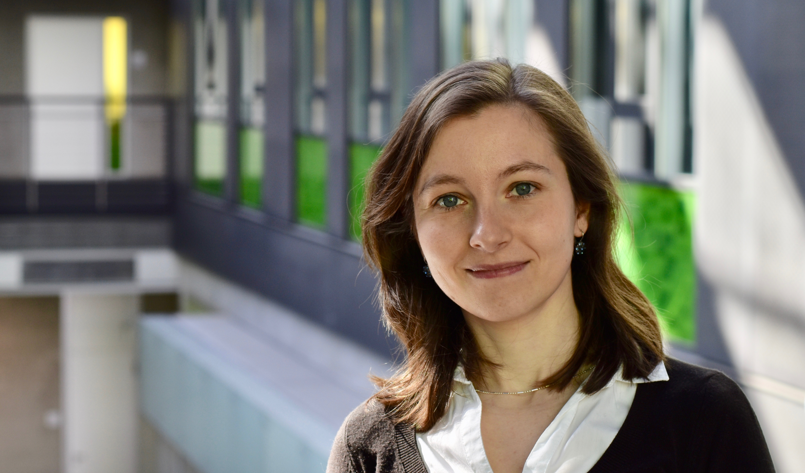

 Martina Brachmann is an ERCIM Alain Bensoussan post-doctoral researcher working at the Networked Embedded Systems (NES) group of Thiemo Voigt at RISE SICS in Stockholm, Sweden.

Martina's research area is the Internet of Things with main focus on communication in low-power wireless networks. Over the past years, she has been working on different aspects and layers in the communication stack, from security over medium access control to physical layer considerations.

Martina completed her PhD at the Technische Universität Dresden, Germany, under guidance of Prof. Dr. Silvia Santini in 2018. From May to August 2015, she joined Prof. Dr. Olaf Landsiedel’s research group in Chalmers University of Technology, Sweden, as a research scholar. She received her Master of Science in Information and Communication Technology from the Brandenburg University of Technology Cottbus (BTU), Germany, in 2012.

## Selected Publications
   * M. Brachmann, O. Landsiedel, D. Göhringer, and S. Santini. [Whisper: Fast Flooding for Low-Power Wireless Networks](https://dl.acm.org/citation.cfm?id=3356341). In: ACM Transactions on Sensor Networks (TOSN), 2019.
   * M. Brachmann, S. Duquennoy, N. Tsiftes, and T. Voigt. IEEE 802.15.4 TSCH in Sub-GHz: Design Considerations and Multi-band Support. In: Proceedings of the IEEE Conference on Local Computer Networks (LCN), 2019. [[paper]](https://e-archivo.uc3m.es/bitstream/handle/10016/29060/tsch_IEEE_2019_ps.pdf?sequence=1)[[code]](https://github.com/martinabr/multi-phy-tsch)
   * M. Brachmann, O. Landsiedel, S. Santini, [Keep the Beat: On-The-Fly Clock Offset Compensation for Synchronous Transmissions in Low-Power Networks](https://ieeexplore.ieee.org/document/8109370), In: IEEE Conference on Local Computer Networks (LCN), 2017. [[code]](https://github.com/martinabr/flock)
   * M. Brachmann, O. Landsiedel, S. Santini, [Concurrent Transmissions for Communication Protocols in the Internet of Things](https://ieeexplore.ieee.org/document/7796815), In: IEEE Conference on Local Computer Networks (LCN), 2016. [[code]](https://github.com/martinabr/laneflood)
   * M. Stein, T. Petry, I. Schweizer, M.Brachmann, M. Mühlhäuser, [Topology Control in Wireless Sensor Networks: What Blocks the Breakthrough?](https://ieeexplore.ieee.org/document/7796813), In: IEEE Conference on Local Computer Networks (LCN), 2016.
   * M. Brachmann, D. Becker, S. Santini, [Poster Abstract: Towards Enabling Concurrent Transmissions in Heterogeneous Networks](https://dl.acm.org/citation.cfm?id=2737164), In: ACM/IEEE International Conference on Information Processing in Sensor Networks (IPSN), 2015.
   * P. M. Scholl, M. Brachmann, S. Santini, K. v. Laerhoven, [Integrating Wireless Sensor Nodes in the Robot Operating System](https://link.springer.com/chapter/10.1007/978-3-642-55029-4_7), In: A. Koubaa and A. Khelil, editors, Cooperative Robots and Sensor Networks 2014, volume 554 of Studies in Computational Intelligence. Springer, 2014.
   * M. Brachmann, S. Santini, [Poster Abstract: Towards the Benchmarking of Ultra-Low Latency Communication Protocols for Wireless Sensor and Actuator Networks](https://dl.acm.org/citation.cfm?id=2517430), In: ACM Conference on Embedded Networked Sensor Systems (SenSys), 2013.
   * I. Gurov, P. E. Guerrero, M. Brachmann, S. Santini, K. v. Laerhoven, A. Buchmann, [Poster Abstract: A Site Properties Assessment Framework for Wireless Sensor Networks](https://dl.acm.org/citation.cfm?id=2517400), In: ACM Conference on Embedded Networked Sensor Systems (SenSys), 2013. 

## Supervised Theses
  * Wolfgang Walter, Besondere Lernleistung (BeLL), "Visualisierung der Signalstärke von Funkwellen durch Echtzeitmessung", 2018 [He won the 3rd place in the regional competition (Dresden-Ostsachsen) at *Jugend forscht - Schüler experimentieren*.](https://jufo-dresden.de/projekt/teilnehmer/matheinfo/M1) **Congratulations!**
  * Wolfgang Walter, Wissenschaftliche Jahresarbeit (WiJa), "Echtzeitmessung und Darstellung der Signalstärke von Funkwellen", 2017/2018
  * Aaron Bulmahn, Bachelor's Thesis, "Reduzierung des Energieverbrauchs von LaneFlood durch FastAwake", 2017
  * Tim Kluge, Bachelor's Thesis, "Kommunikation im Internet der Dinge mittels Gleichzeitiges Senden", 2016
  * David Ordnung, Bachelor's Thesis, "Erkennen und Behandeln von Paketverlusten in Protokollen basierend auf simultanem Übertragen", 2016
  * Nicolas Coppik, Master's Thesis, "Selective Forwarding Mechanisms for Flooding-based Synchronous Transmissions", 2014
  * Dennis Becker, Master's Thesis, "Exploiting Constructive Interference in Heterogeneous Networks on the Example of Glossy", 2014
  
## Teaching Activities
   * SS2018, Hardwarepraktikum (HWP), TU Dresden
   * SS2018, Informatik 2 für ET/MT/RES, TU Dresden
   * WS2017, Informatik 1 für ET/MT/RES, TU Dresden
   * SS2017, Hardwarepraktikum (HWP), TU Dresden
   * SS2016, Hardwarepraktikum (HWP), TU Dresden
   * SS2014, Communication Networks I (KN1), TU Darmstadt
   * SS2013, Communication Networks I (KN1), TU Darmstadt
   * SS2013, Wireless Sensor Networks (Seminar), TU Darmstadt
   * WS2013, Mobile Sensing Lab Seminar (Projektseminar), TU Darmstadt

